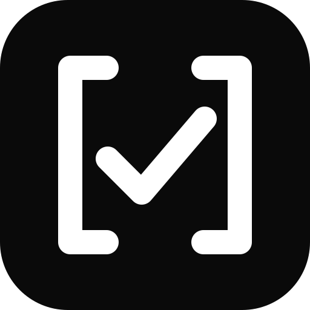
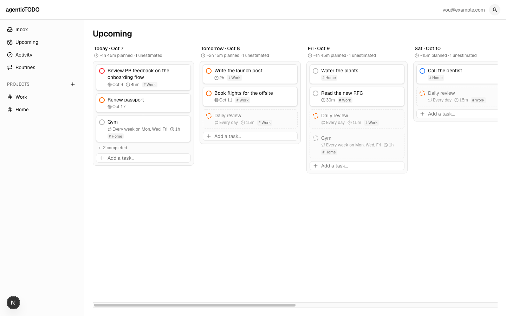

<p align="center">
  
</p>

<h1 align="center">agenticTODO</h1>

<p align="center">A free todo list with no AI inside. Your coding agent is the AI.</p>

<p align="center">
  
</p>

The web app at [todo.g7xu.dev](https://todo.g7xu.dev) holds your tasks, projects and routines.
Claude connects to the same account through a remote MCP server at `https://todo.g7xu.dev/api/mcp`,
so you can ask it what is due, how a routine is going, or to add and reschedule work.

## Connect Claude Code

You need [Claude Code](https://code.claude.com) and an account on agenticTODO. If you have never
signed in, the first connection creates your account and Inbox.

1. Register the server once, for all your projects:

   ```bash
   claude mcp add -s user --transport http agentictodo https://todo.g7xu.dev/api/mcp
   ```

2. Start a session with `claude`, run `/mcp`, select **agentictodo** and choose **Authenticate**.

3. Your browser opens the consent page. Sign in with Google or an email code if asked, check that
   it says **claude.ai wants to connect**, and click **Approve**. The page says you will be returned
   to an app on this computer; that is Claude Code waiting on a local port, and is expected.

4. Back in the terminal, `/mcp` shows `agentictodo` as connected. Try:

   - "What's due this week?"
   - "Add 'renew passport' for Friday with a deadline of the 20th."
   - "How is my daily review routine going over the last four weeks?"
   - "Move everything due today that isn't priority 1 to tomorrow."

Claude asks before each write tool runs; that prompt is your approval. Choosing "Always allow" on
a write tool lets Claude edit without asking.

### Connect claude.ai instead

Go to **Customize → Connectors → Add custom connector**, enter `https://todo.g7xu.dev/api/mcp`,
choose **Sign in now**, and approve on the consent page. Then enable the connector for a chat from
the **+** menu.

### Disconnecting and re-signing in

- **Settings → Connected apps** lists every connection; **Disconnect** takes effect immediately.
- If you do not use the connector for 30 days, Claude asks you to sign in again. Run `/mcp` and
  choose **Authenticate**.
- To remove it from Claude Code entirely: `claude mcp remove -s user agentictodo`.

## What Claude can do

Read and change tasks and projects; read routines and their completion history. Routines are
edited in the app. The tool list and the security model are in [docs/MCP.md](docs/MCP.md).

## Development

Requires Node.js 22+ and a Neon project with Neon Auth.

```bash
npm install
cp .env.local.example .env.local   # fill in the Neon values; APP_URL must match the dev URL
npm run dev -- -p 3001
```

Then point Claude Code at `http://localhost:3001/api/mcp` under a different name to test against
the dev database.

```bash
npm test                 # unit tests
npm run lint
```

End-to-end and security suites, which need a running server, are described in
[tests/e2e/README.md](tests/e2e/README.md).

## Docs

- [docs/MCP.md](docs/MCP.md): MCP server and OAuth design, security checklist, deploy checklist
- [docs/AGENT.md](docs/AGENT.md): what the agent is for
- [docs/design/](docs/design/): the requirements, technical design and decision log the app was
  built from, including [DECISIONS.md](docs/design/DECISIONS.md)

Contributions: see [CONTRIBUTING.md](CONTRIBUTING.md).

## License

[MIT](LICENSE) © 2026 Guoxuan Xu

Dependencies keep their own licenses. One of them, `ua-parser-js` v2, which `@neondatabase/auth`
pulls in for its sessions UI, is licensed AGPL-3.0.
